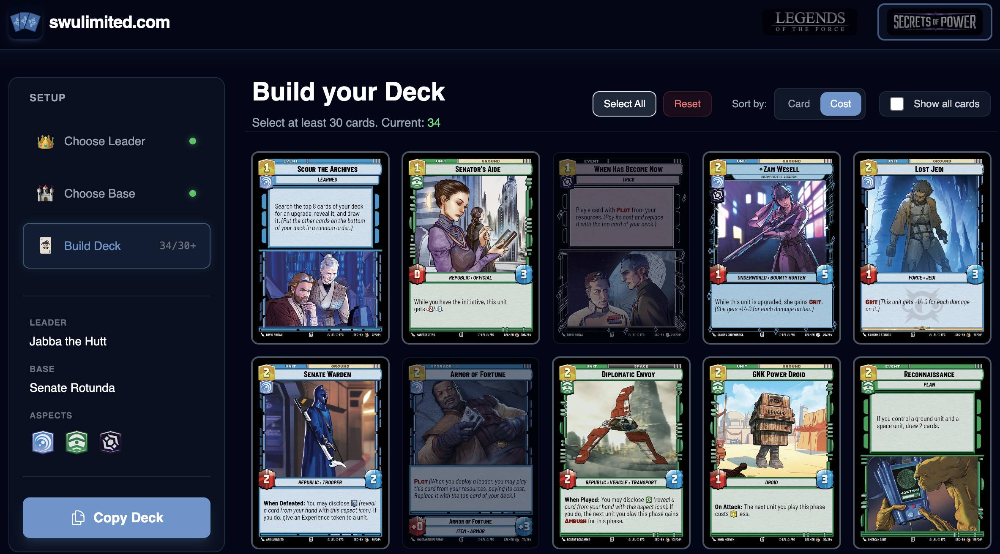

# swulimited.com

A simple app to simulate a sealed event for the trading card game **Star Wars Unlimited**.



## Features

- **Booster Pack Simulation**: Simulates opening 6 booster packs (16 cards each) following official rarity and slot distribution rules.
- **Deck Building**: Interactive interface to build a sealed deck with a minimum of 30 cards.
- **Set Support**: Includes logic for different sets (e.g., LOF, SEC) with specific card rules.
- **Export**: Copy your deck to clipboard in a JSON format compatible with [swudb.com](https://swudb.com).

## Tech Stack

- [Nuxt 4](https://nuxt.com)
- [Tailwind CSS](https://tailwindcss.com)
- Hosted on GitHub Pages

## Getting Started

```bash
# Install dependencies
npm install

# Start development server
npm run dev
```

## License

Apache License 2.0
